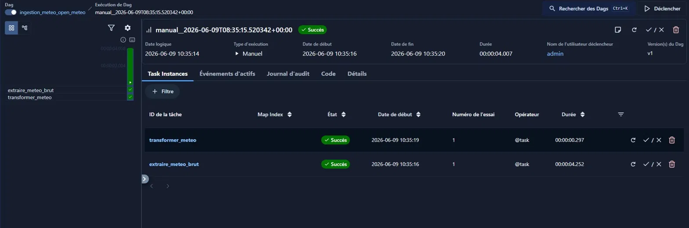
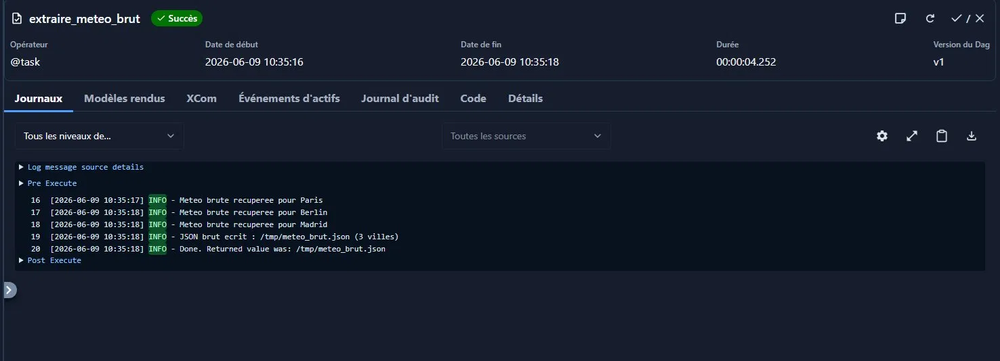
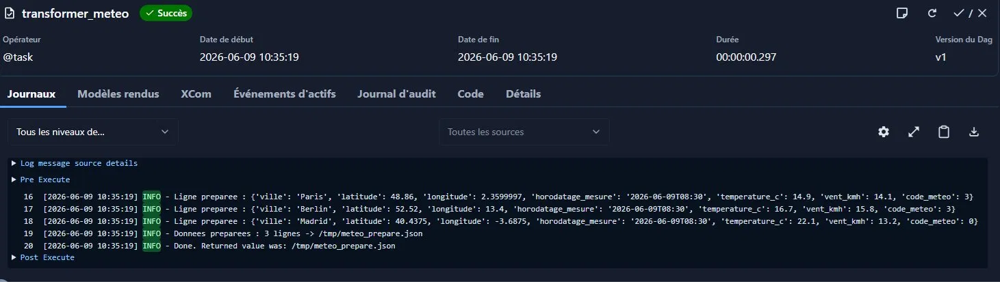

# TP 2A — Ingestion météo Open-Meteo

Petit pipeline Airflow qui va chercher la météo du moment pour 3 villes (Paris, Berlin, Madrid) via l'API Open-Meteo, et qui met les données au propre pour pouvoir les charger plus tard dans une table.

J'ai séparé le DAG en deux tâches : une qui récupère, une qui transforme. Open-Meteo est gratuit et ne demande pas de clé.

## Ce que j'ai utilisé
- Airflow 3.2.2 (syntaxe `@dag` / `@task`)
- Python 3.14
- API Open-Meteo
- Lancé en local avec `airflow standalone` sous WSL

## Le DAG

Fichier : [`ingestion_meteo_open_meteo.py`](ingestion_meteo_open_meteo.py)

Deux tâches, dans cet ordre :

```
extraire_meteo_brut  -->  transformer_meteo
```

- **extraire_meteo_brut** : boucle sur les 3 villes, appelle l'API et garde la réponse JSON telle quelle dans un fichier. Je ne touche à rien ici, c'est juste de la récup.
- **transformer_meteo** : relit ce fichier et reconstruit une liste propre, une ligne par ville, avec seulement les colonnes qui m'intéressent.

J'ai fait exprès de ne pas tout faire dans une seule fonction : si demain l'API change ou que je veux tester juste la transformation, c'est plus simple.

## Brut vs préparé

- la réponse complète de l'API est gardée dans `meteo_brut.json`
- la version nettoyée (1 ligne / ville) part dans `meteo_prepare.json`

Entre les deux tâches, je ne fais pas passer toute la donnée par XCom, juste le chemin du fichier. C'est ce qu'on a vu en cours : XCom sert à passer une petite info (ici un chemin), pas à transporter un gros JSON.

## Les champs que j'ai gardés

Je n'ai pas tout repris de la réponse API, seulement ce qui sert :

- `ville` : pour savoir de quelle ville on parle
- `latitude` / `longitude` : la position du point de mesure
- `horodatage_mesure` : la date/heure de la mesure (utile pour pas avoir de doublons plus tard)
- `temperature_c` : la température, c'est le coeur du besoin
- `vent_kmh` : la vitesse du vent
- `code_meteo` : un code qui dit si c'est soleil, pluie, etc.

Ce que j'ai laissé de côté : `winddirection`, `is_day`, `elevation`, `generationtime_ms`, les infos de timezone... Pas besoin pour ce qu'on veut faire, donc autant pas surcharger la future table.

Du coup la table cible ressemblerait à ça :

```sql
CREATE TABLE meteo_villes (
    ville              TEXT,
    latitude           DOUBLE PRECISION,
    longitude          DOUBLE PRECISION,
    horodatage_mesure  TIMESTAMP,
    temperature_c      DOUBLE PRECISION,
    vent_kmh           DOUBLE PRECISION,
    code_meteo         INTEGER
);
```

## Ce que ça donne en sortie

Résultat du run (aussi dans `apercu_donnees_preparees.json`) :

| ville | lat | lon | horodatage | temp (°C) | vent (km/h) | code |
|-------|-----|-----|------------|-----------|-------------|------|
| Paris | 48.86 | 2.36 | 2026-06-09T08:30 | 14.9 | 14.1 | 3 |
| Berlin | 52.52 | 13.40 | 2026-06-09T08:30 | 16.7 | 15.8 | 3 |
| Madrid | 40.44 | -3.69 | 2026-06-09T08:30 | 22.1 | 13.2 | 0 |

## Pour relancer

```bash
export AIRFLOW_HOME=~/airflow-tp
source venv/bin/activate
airflow standalone
# puis http://localhost:8080, activer le DAG et cliquer sur Déclencher
```

## Captures

Les 2 tâches en succès :



Les logs de la transfo et extraction :




